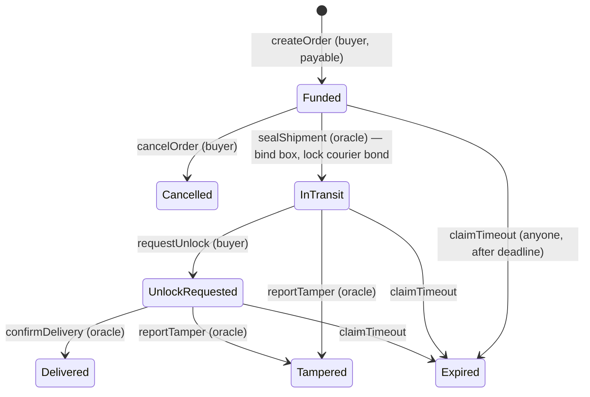
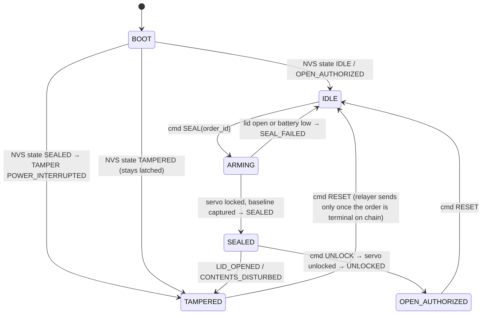

# TamperSafe — Architecture

Chain facts, compiler rules and Neurick board facts live in `CLAUDE.md` and the two skills (`mst-contract-deploy`, `neurick-firmware`). This file is the design: who does what, the contract spec, the box state machine, and the wire formats between box, relayer, chain and dashboard. The tables here are the contract between tracks. Change them only through the main session, and update every consumer in the same commit.

---

## 1. Actors

| Actor | Holds | Does |
| :--- | :--- | :--- |
| **Buyer** | own wallet (MetaMask) | Creates and funds the order, cancels before dispatch, and presses **Confirm & Unlock** at the doorstep |
| **Seller** | own wallet | Gets paid on clean delivery. Receives the courier's slashed bond on tamper or timeout |
| **Courier** | own wallet | Deposits a bond and carries the box |
| **Depot operator** | dashboard (no wallet in P0) | Puts the goods in the box and triggers **Seal** |
| **Box** | Neurick board + sensors + per-box HMAC secret | Locks, monitors, detects and latches tamper, and reports |
| **Relayer** | the ORACLE key (the only key on the laptop) | Verifies box messages, writes transitions to chain, and relays commands to the box |
| **Admin** | deployer wallet | Deploys, grants roles and registers boxes. The team runs these steps |

---

## 2. System view

```
┌──────────── TamperSafe box ────────────┐
│ HC-SR04 (contents)   IR (lid)          │
│ GPS NEO-6M           MPU6050 (shock)   │
│ Servo latch (STM32)  OLED (state)      │
│ ESP32-S3: state machine, NVS latch,    │
│ hash chain, ring buffer                │
└───────────────┬────────────────────────┘
                │ POST /api/device/events (JSON + HMAC), every 2 s
                │ ◀── response carries the pending command (SEAL / UNLOCK / RESET)
┌───────────────▼────────────────────────┐        ┌──────── dashboard (React) ────────┐
│ relayer (Node + ethers v6, laptop)     │──SSE──▶│ Buyer · Courier · Depot · Track · │
│ ingest → verify → JSONL → rules        │◀─REST──│ Evidence                          │
│ chain writer (1 queue, ORACLE key)     │        └──────┬───────────────▲────────────┘
│ chain listener (UnlockRequested)       │               │ buyer/courier │ reads events
└───────────────┬────────────────────────┘               │ txs (MetaMask)│
                │ ORACLE txs                             ▼               │
┌───────────────▼────────────────────────────────────────────────────────┴──┐
│ MST testnet: BoxRegistry · TamperSafeEscrow (holds tMSTC) · TelemetryAnchor │
└────────────────────────────────────────────────────────────────────────────┘
```

---

## 3. Trust model (state it honestly in the pitch)

**What P0 builds:**
- **Box ↔ relayer:** each box shares a 32-byte secret with the relayer.
  - Every batch carries an HMAC-SHA256 over the batch's last hash-chain head (§9.1).
  - The relayer rejects batches with a bad MAC, a broken chain or a replayed sequence number.
- **Relayer = trusted oracle** holding `ORACLE_ROLE`.
  - It can call only `sealShipment`, `reportTamper`, `confirmDelivery`, `anchor` and `logAlert`.
  - It cannot name a payee. Payees are fixed by the order (buyer and seller) and the seal (courier).
- **Buyer intent is signed by the buyer's own wallet:** `createOrder`, `cancelOrder` and `requestUnlock`. The relayer cannot release funds before the buyer asks to unlock.
- **Audit trail:**
  - Every box event is hash-chained on the device.
  - The relayer anchors chain heads on-chain.
  - The dashboard's **Verify log** recomputes the chain in the browser and compares it with the anchored head. An anchored history cannot be rewritten without the mismatch showing.

**Known gaps (say them on stage):**
- The relayer could falsely report tamper.
- The courier never signs the seal. The oracle chooses whose bond `sealShipment` locks. A courier opt-in (`acceptShipment` from the courier's wallet) is the fix.
- The HMAC secret sits in ESP32 flash, with no secure element.
- Connectivity is the courier's phone hotspot.

**Production path:**
- Stretch **S2** (see the plan): device-signed attestations checked by `ecrecover` against `BoxRegistry.deviceKey`, which makes the relayer a gas payer only.
- A secure element (ATECC608).
- LTE-M / NB-IoT connectivity.

---

## 4. Order lifecycle (on-chain)



| Terminal state | Order amount goes to | Locked courier bond goes to |
| :--- | :--- | :--- |
| Delivered | seller | back to courier's free balance |
| Tampered | buyer | seller (goods were compromised in the courier's custody) |
| Expired | buyer | seller (if the order was sealed) |
| Cancelled | buyer | — (never sealed) |

Every terminal transition unbinds the box in `BoxRegistry`. Terminal states accept no further calls.

**GPS never gates a transition.** `confirmDelivery` records location as evidence (`gpsFix` says whether it is real). Invariant 4 in `CLAUDE.md` explains why.

---

## 5. Contracts

Common to all three contracts:
- OpenZeppelin v5 `AccessControl`, custom errors, and one event per state change carrying the fields the dashboard reads.
- Amounts are wei of native **tMSTC**. Coordinates are `int32` microdegrees (`lat × 1e6`).
- Box ids are `bytes32 = keccak256(bytes("TS-BOX-01"))`. Firmware and relayer use the string form.

### 5.1 `BoxRegistry`

`Box { address deviceKey; bool active; uint256 activeOrderId; string label; }`. `activeOrderId == 0` means the box is free, which is why order ids start at 1. `deviceKey` is unused in P0 and reserved for S2.

| Function | Caller | Effect / reverts |
| :--- | :--- | :--- |
| `registerBox(bytes32 boxId, address deviceKey, string label)` | `DEFAULT_ADMIN_ROLE` | Adds the box. Reverts `BoxExists` |
| `setActive(bytes32 boxId, bool active)` | `DEFAULT_ADMIN_ROLE` | Enables or disables the box. Reverts `BoxUnavailable` if the box was never registered (else an unknown id could be bound, then wiped by a later `registerBox`) |
| `bind(bytes32 boxId, uint256 orderId)` | `BINDER_ROLE` (the escrow) | Requires the box to be active and free. Reverts `BoxUnavailable` |
| `unbind(bytes32 boxId)` | `BINDER_ROLE` | Frees the box |
| `getBox(bytes32 boxId)` | view | — |

Events: `BoxRegistered(boxId, deviceKey, label)`, `BoxActiveSet(boxId, active)`, `BoxBound(boxId, orderId)`, `BoxUnbound(boxId, orderId)`.

Errors: `BoxExists(boxId)`, `BoxUnavailable(boxId)`.

### 5.2 `TamperSafeEscrow` (holds the funds)

Roles: `DEFAULT_ADMIN_ROLE` (deployer) and `ORACLE_ROLE` (relayer). Inherits `ReentrancyGuard`.

`Order` fields:

| Field | Type | Set by |
| :--- | :--- | :--- |
| `buyer` | `address` | `createOrder` (`msg.sender`) |
| `seller` | `address` | `createOrder` |
| `amount` | `uint256` | `createOrder` (`msg.value`) |
| `deadline` | `uint64` | `createOrder` (unix seconds) |
| `destLat`, `destLon` | `int32` | `createOrder` |
| `courier` | `address` | `sealShipment` |
| `boxId` | `bytes32` | `sealShipment` |
| `bond` | `uint256` | `sealShipment`: `amount × bondBps / 10_000` |
| `baselineHash` | `bytes32` | `sealShipment` (head of the box's `SEALED` event) |
| `status` | `Status` (§6) | each transition |
| `tamperCode` | `uint8` (§6) | `reportTamper` |

| Function | Caller | From → To | Money |
| :--- | :--- | :--- | :--- |
| `createOrder(address seller, int32 destLat, int32 destLon, uint64 deadline) payable → uint256 orderId` | buyer | — → Funded | Holds `msg.value`. Reverts on zero amount, past deadline, `seller == buyer` or `seller == address(0)` |
| `cancelOrder(uint256 id)` | buyer | Funded → Cancelled | amount → buyer |
| `depositBond() payable` | courier | — | Adds to `bondBalance[courier]` |
| `withdrawBond(uint256 amt)` | courier | — | Free (unlocked) bond → courier |
| `sealShipment(uint256 id, bytes32 boxId, address courier, bytes32 baselineHash)` | ORACLE | Funded → InTransit | Locks `bond` from the courier's free balance (reverts `InsufficientBond`), then `registry.bind` |
| `requestUnlock(uint256 id)` | buyer | InTransit → UnlockRequested | — |
| `confirmDelivery(uint256 id, bytes32 logHead, int32 lat, int32 lon, bool gpsFix)` | ORACLE | UnlockRequested → Delivered | amount → seller. Bond unlocked. Box unbound |
| `reportTamper(uint256 id, uint8 code, bytes32 evidenceHash)` | ORACLE | InTransit / UnlockRequested → Tampered | amount → buyer. Bond → seller. Box unbound |
| `claimTimeout(uint256 id)` | anyone, `block.timestamp > deadline` | Funded / InTransit / UnlockRequested → Expired | amount → buyer. Bond (if locked) → seller. Box unbound |
| `setBondBps(uint16 bps)` | `DEFAULT_ADMIN_ROLE` | — | Default 10 000 (bond = goods value) |
| `getOrder(id)`, `bondBalance(addr)`, `lockedBond(addr)`, `orderCount()` | view | — | — |

`bondBalance[courier]` is the courier's **free** (lockable/withdrawable) bond; `lockedBond[courier]` is the portion currently locked against a sealed shipment. `sealShipment` moves `bond` from free to locked; `confirmDelivery` moves it back to free; `reportTamper`/`claimTimeout` (if sealed) remove it from locked and pay it to the seller.

Events:
- `OrderCreated(id, buyer, seller, amount, deadline)`
- `OrderCancelled(id)`
- `BondDeposited(courier, amount)`
- `BondWithdrawn(courier, amount)`
- `ShipmentSealed(id, boxId, courier, bond, baselineHash)`
- `UnlockRequested(id, boxId)`, which the relayer listens for
- `Delivered(id, logHead, lat, lon, gpsFix)`
- `TamperDetected(id, boxId, code, evidenceHash)`
- `OrderExpired(id)`
- `FundsReleased(id, to, amount, kind)`, where `kind` is `ReleaseKind` (`uint8`: `0 PAYMENT · 1 REFUND · 2 BOND_SLASH`)
- `BondBpsSet(bps)`, emitted by `setBondBps`

Errors: `InvalidStatus(id, current)`, `NotBuyer()`, `InvalidSeller()` (createOrder: `seller == msg.sender` or `seller == address(0)`), `BoxUnavailable(boxId)`, `InsufficientBond(courier, needed, free)`, `DeadlineNotReached()`, `BadDeadline()`, `ZeroAmount()`, `TransferFailed(to)`.

Rules:
- Follow checks → effects → interactions.
- Put `nonReentrant` on every function that sends tMSTC.
- Send with a push `call`. Demo recipients are EOAs; pull-payments are the production hardening.

### 5.3 `TelemetryAnchor`

Roles: `ORACLE_ROLE`.

| Function | Caller | Effect |
| :--- | :--- | :--- |
| `anchor(uint256 orderId, uint32 seq, bytes32 head, uint16 count)` | ORACLE | Requires `seq` > the stored seq for the order. Stores `{seq, head, timestamp}` |
| `logAlert(uint256 orderId, uint8 code, bytes32 evidenceHash)` | ORACLE | Emits only |
| `latest(uint256 orderId)` | view | `{seq, head, timestamp}` |

Events: `Anchored(orderId, seq, head, count)`, `Alert(orderId, code, evidenceHash)`.

Errors: `StaleSeq(orderId, seq, latestSeq)` — `anchor` reverts when `seq` does not strictly increase over the order's previously stored seq (0 before the first anchor, so the first call needs `seq ≥ 1`).

---

## 6. Shared codes (single source for contract, firmware, relayer and UI)

**Order `Status`**: `0 None · 1 Funded · 2 InTransit · 3 UnlockRequested · 4 Delivered · 5 Tampered · 6 Expired · 7 Cancelled`

**Tamper codes** latch on the box, refund the buyer and go through `Escrow.reportTamper`:

| Code | Name | Source |
| :--- | :--- | :--- |
| 1 | `LID_OPENED` | IR lid sensor (CH15) while SEALED — primary physical tamper |
| 2 | `CONTENTS_DISTURBED` | (Optional/legacy: ultrasonic sensor dropped by team for hardware simplicity) |
| 3 | `POWER_INTERRUPTED` | box booted with NVS state SEALED |

**Alert codes** are evidence only and go through `Anchor.logAlert`:

| Code | Name | Source |
| :--- | :--- | :--- |
| 10 | `SHOCK` | MPU6050 |
| 11 | `TILT` | MPU6050 |
| 12 | `SIGNAL_LOST` | relayer watchdog |
| 13 | `LOG_GAP` | relayer: sequence gap |
| 14 | `ROUTE_DEVIATION` | relayer (stretch S1) |
| 15 | `SENSOR_FAULT` | box: ultrasonic invalid reads |
| 16 | `PACKAGE_MISMATCH` | RFID reader: sealed package's tag UID absent or changed while SEALED |

**Box states**: `BOOT · IDLE · ARMING · SEALED · TAMPERED · OPEN_AUTHORIZED`

**Device event types**: `BOOT · TELEMETRY · SEALED · SEAL_FAILED · TAMPER · ALERT · UNLOCKED · RESET_DONE`

**Commands** (relayer → box): `SEAL · UNLOCK · RESET`

---

## 7. What goes on-chain

| Data | Where | When |
| :--- | :--- | :--- |
| Order, funds, state transitions | Escrow events | Every transition |
| Tamper | `Escrow.reportTamper` | Immediately, at the front of the tx queue |
| Alerts | `Anchor.logAlert` | As they happen, at most 1 per code per order per 60 s |
| Hash-chain head | `Anchor.anchor` | Every 30 s or 20 events while InTransit, and at every transition |
| Raw telemetry | relayer `data/<box_id>.jsonl` | Every batch (off-chain, verifiable against anchors) |

---

## 8. Box firmware



- **Authorized open vs tamper:** tamper rules run only in `SEALED`. In `OPEN_AUTHORIZED`, lid and contents changes are expected and never raise tamper.
- **Latch first, then report:** write the new state to NVS *before* sending the TAMPER event.
- **TAMPERED:** the servo stays locked until RESET. The OLED shows `TAMPERED: <name>` and telemetry continues.
- **NVS keys:** `state`, `order_id`, `seq`, `head`, `baseline_mm`, `tamper_code`, `boot_count`.
  - Write `state` immediately on every transition.
  - Write `seq` and `head` on every event generated.
- **Alerts** (SHOCK, TILT, SENSOR_FAULT, PACKAGE_MISMATCH) never change state. `PACKAGE_MISMATCH` is identity evidence, not a tamper signal — it does not gate `reportTamper` or any escrow transition.
- **Thresholds and sampling rates** are in `docs/HARDWARE.md` §5.

**Two tasks, so the network never blinds the sensors.** An HTTP POST can block for up to 3 s, and a lid lifted and re-closed inside a stalled POST must still latch. The work is split across the two cores:
- **`loop()` on core 1** runs the state machine, every sensor read and all I2C traffic (OLED, MPU6050, `nr.*`).
- **A FreeRTOS network task on core 0** runs Wi-Fi, NTP and the batch POST. It only ever touches the ring buffer and the pending-command slot.
- The two tasks hand off through a mutex-guarded ring buffer and a command slot. Only `loop()` touches the I2C bus.

`loop()` cadence (non-blocking `millis()` scheduler):

| Task | Rate |
| :--- | :--- |
| IR lid read (CH15) | 20 Hz |
| Ultrasonic | DROPPED (hardware simplicity) |
| MPU6050 | 20 Hz |
| GPS UART parse | every loop |
| `nr.updateSensors()` (battery, button) | 2 Hz |
| OLED refresh | 2 Hz |
| TELEMETRY event | every 2 s in SEALED, every 10 s otherwise |
| POST batch (network task) | every 2 s, and immediately after TAMPER / SEALED / UNLOCKED |

Ring buffer: 128 events in RAM. When it is full, the oldest is dropped and the relayer reports `LOG_GAP`.

---

## 9. Device ↔ relayer protocol

### 9.1 Canonical event, hash chain, MAC

Use integers only, because float formatting differs between ESP32 and Node:

```
canon  = "v1|" + box_id|seq|ts|type|state|order_id|lat_e6|lon_e6|fix|dist_mm|lid|accel_mg|tilt_deg|lock|batt_mv|code|cmd_id
head_n = lowercase_hex( SHA-256( head_{n-1} + "|" + canon_n ) )
mac    = lowercase_hex( HMAC-SHA256( box_secret, box_id + "|" + last_seq + "|" + last_head ) )
```

`box_secret` is the **32 raw bytes** decoded from the hex secret (not the 64-character ASCII hex string itself). Firmware decodes `secrets.h`'s hex string to bytes before calling mbedtls HMAC; the relayer decodes `BOX_SECRETS`' hex value the same way with `Buffer.from(hex, "hex")` before calling Node's `crypto.createHmac`. Both sides must agree on this or every MAC mismatches.

Field encodings:
- `ts`: unix seconds from NTP, or `0` until synced.
- `fix`: `0/1`.
- `lid`: `1` closed, `0` open.
- `lock`: `L`/`U`.
- `code`: tamper or alert code, else `0`.
- `cmd_id`: empty string when absent.

The genesis `head` is 64 × `"0"` on the box's first boot. After that the chain continues across orders and reboots, since `seq` and `head` are persisted.

Hashing choices:
- The chain uses SHA-256, not keccak, so the ESP32 uses mbedtls and the browser uses WebCrypto.
- On-chain fields store the 32 bytes as `bytes32`.

**Test vectors:** M3 writes `relayer/test/vectors.json`, containing 3 events, their expected heads, and the MAC for a dummy secret. The firmware boot self-test must reproduce them byte for byte. This is the most likely integration bug, so it gets built first.

### 9.2 `POST /api/device/events`

```json
{
  "box_id": "TS-BOX-01",
  "events": [
    { "seq": 42, "ts": 1790582400, "type": "TELEMETRY", "state": "SEALED", "order_id": 3,
      "lat_e6": 12971599, "lon_e6": 77594566, "fix": 1, "dist_mm": 84, "lid": 1,
      "accel_mg": 1020, "tilt_deg": 3, "lock": "L", "batt_mv": 11800, "code": 0, "cmd_id": "",
      "head": "3f2a…64 hex…" }
  ],
  "mac": "9b1c…64 hex…"
}
```

Response `200`:
```json
{ "ok": true, "ack_seq": 42, "command": { "id": "cmd-9", "type": "UNLOCK", "order_id": 3 } }
```

Commands:
- `command` is `null` when nothing is pending.
- The box acknowledges a command by emitting the resulting event (`SEALED`, `SEAL_FAILED`, `UNLOCKED` or `RESET_DONE`) with `cmd_id` set.
- The relayer re-sends an unacknowledged command on every response.

Relayer checks, in order:
1. Schema (`400`).
2. MAC (`401`).
3. `seq ≤ last seen` → duplicate, which the relayer drops and acks.
4. `seq == last + 1` with a mismatched head → `409 { "expected_seq" }`, treated as forgery.
5. `seq > last + 1` → accept, re-base on the new head, and raise `LOG_GAP`.

### 9.3 Dashboard-facing API (relayer, default port 4000)

| Route | Purpose |
| :--- | :--- |
| `GET /api/orders` | Chain state merged with the latest telemetry, per order |
| `GET /api/orders/:id/log` | Full event log + `{ anchored_seq, computed_head_at_anchored_seq, anchored_head, match }`. Verification recomputes the chain **up to `Anchor.latest.seq`** and compares at that seq, because telemetry after the last anchor is expected to run ahead |
| `POST /api/orders/:id/seal` `{ box_id, courier }` | Depot. Pre-checks: order Funded, box free, courier's free bond ≥ required. Then queues SEAL |
| `POST /api/boxes/:box_id/reset` | Depot. Queues RESET only when the box has no non-terminal order |
| `GET /api/boxes` | Box list with last-seen, state and GPS mode (`LIVE` / `NO_FIX` / `SIMULATED`) |
| `POST /api/demo/gps-sim` `{ box_id, enabled }` | Simulated route for **display only**, badged SIMULATED. On-chain `confirmDelivery` always carries the box's real `fix` flag |
| `GET /api/stream` | SSE events: `telemetry`, `tx` (submitted / confirmed / failed + explorer URL), `alert`, `order` |

---

## 10. Relayer internals

Ingest pipeline: schema → MAC → **recompute every event's head from its own fields (never trust the batch's claimed `head` — the MAC only authenticates the last event in the batch, so a tampered middle field must be caught by the chain-verify step re-deriving the hash, not by trusting the string on the wire)** → append `data/<box_id>.jsonl` → SSE → rules.

The rules below exist because firmware M4 re-emits TAMPER on every boot that comes up `TAMPERED` against a real order (not just the boot that first caused it), so the relayer must treat a repeat as a no-op rather than retrying a call the contract will revert. Every rule below checks the order's **current on-chain status** (`Escrow.getOrder(id).status`) before sending a transaction — never assumes the device event alone tells you what's still valid on-chain:

| Device event | On-chain status | Relayer action |
| :--- | :--- | :--- |
| `SEALED` (answering a SEAL command) | Funded | `Escrow.sealShipment(order, boxId, courier, head)` |
| `TAMPER` | InTransit or UnlockRequested | `Escrow.reportTamper(order, code, head)`, at the front of the queue |
| `TAMPER` | Tampered (already reported) | No transaction. Ack the device so it stops resending |
| `TAMPER` | Funded (box sealed locally, e.g. via a SEAL retry after a failed transaction, but the seal transaction never landed on-chain) | No transaction. Raise an SSE alert so a human notices the box thinks it's sealed and the chain doesn't; ack the device |
| `ALERT` | any | `Anchor.logAlert(order, code, head)`, rate-limited per §7 |
| `UNLOCKED` | UnlockRequested | `Escrow.confirmDelivery(order, head, lat_e6, lon_e6, fix)` |
| `UNLOCKED` | Delivered (already confirmed) | No transaction. Ack the device |
| `UNLOCKED` | Funded (a seal-abort — see below) | No transaction. Ack the device |
| every 30 s / 20 events while InTransit | — | `Anchor.anchor(order, seq, head, count)` |

**Seal abort:** if `sealShipment` fails permanently (a decoded revert, see below), the box is still physically SEALED and only accepts UNLOCK — there is no on-chain state to undo since the seal never landed. Queue UNLOCK for that box so the depot can physically recover it, rather than leaving it locked with nothing on-chain backing it.

**Revert handling:**
- A revert the relayer can decode as one of the contracts' custom errors (`InvalidStatus`, `BoxUnavailable`, `InsufficientBond`, ...) is permanent — the retry would fail identically. Never retry it; log it, surface it over SSE, and move on to the next queued action.
- Only transport-layer failures (RPC timeout, connection reset), nonce errors, and fee-estimation failures get the 2 retries.

**Command queue (relayer → box):**
- When an order reaches a terminal status (Delivered / Tampered / Expired / Cancelled), cancel any command still queued for its box — a stale SEAL or UNLOCK must never fire against a box whose order has already resolved.
- RESET supersedes any other pending command for that box. This matters because a box stuck TAMPERED ignores UNLOCK entirely (per firmware's command handling), so if UNLOCK is still sitting in the single command slot when RESET needs to go out, RESET can never get through — RESET must displace it.
- The RESET pre-check reads `BoxRegistry.getBox(boxId).activeOrderId == 0`, **not** the box's own reported `order_id` — a box can tamper against an order that was Funded but never actually sealed on-chain (see the seal-abort case above), in which case the box's local `order_id` is nonzero but the registry was never bound. Checking the registry, not the box, is what lets that box be reset.

**Box re-provisioning:** accept a batch that restarts at `seq == 1` with a hash chain that verifies from the genesis head and a valid MAC, treating it as the box having been re-flashed or flash-erased (the firmware setup notes recommend "Erase All Flash Before Sketch Upload" to clear a latched TAMPERED state on the bench). Re-base the relayer's last-seen `seq`/`head` for that box on the new chain and raise an SSE alert noting the reset. Without this, every event after a flash-erase gets silently dropped as a duplicate (`seq ≤ last seen`) and nothing — including a real SEALED — would ever reach the chain again, with no visible error.

Background workers:
- **Chain listener:** watches for `UnlockRequested(id, boxId)` and queues UNLOCK for that box. Polling interval 1 s. **Reconciles at startup** by scanning `getOrder` across all known orders for any already sitting in UnlockRequested, not only new events after startup — a relayer restart must not lose a pending unlock.
- **Watchdog:** raises `SIGNAL_LOST` once per outage when a box in SEALED sends nothing for 30 s.

Chain writer:
- A typed wrapper exposing exactly the five ORACLE-role functions (`sealShipment`, `reportTamper`, `confirmDelivery`, `anchor`, `logAlert`) — no other contract call is reachable through it, so Invariant 1 (the relayer never names a payee) holds by construction, not by convention.
- One queue with one in-flight transaction.
- Nonce from `getTransactionCount("pending")` at startup, then incremented locally.
- Legacy transactions (`type: 0`, fixed `gasPrice`) when fee estimation fails.
- 2 retries (transport/nonce/fee errors only — see Revert handling above).
- Every step is pushed to SSE. **Explorer links (`https://testnet.mstscan.com/tx/<hash>`) are only ever built when `CHAIN=mst`** — a local Hardhat transaction hash is not resolvable on `mstscan.com`, and the UI must never construct a link that leads nowhere.
- **Persist pending commands to disk** (`cmd_id → { orderId, courierAddress, boxId }`) as they're queued, not just in memory — a relayer restart mid-seal must not lose track of which courier a pending SEAL was locking a bond for.
- **Rebuild in-memory state at startup** from `data/<box_id>.jsonl` for every known box: last seen `seq` and `head`, so a restart doesn't re-derive trust from nothing.

Signing (**local only** — this repo/agents never hold a testnet key):
- `CHAIN=local`: the relayer signs with a Hardhat dev account via `provider.getSigner(deployments/local.json's relayerOracle.address)` — confirm first that `eth_accounts` on the local node actually returns that address as one of its unlocked dev accounts. No private key is read from anywhere for this path.
- `CHAIN=mst`: reads `ORACLE_PRIVATE_KEY` from `.env` — never touched by any agent, team-only, M6.
- At startup, `getCode()` on every address in the active `deployments/<chain>.json` must return more than `0x`, or the relayer refuses to start — a stale `local.json` (left over from a killed `hardhat node`) must fail loudly, not silently send transactions into empty addresses.

Config lives in `relayer/.env` (gitignored; `.env.example` is committed):
- `CHAIN=local|mst`
- `MST_RPC`, `LOCAL_RPC`
- `ORACLE_PRIVATE_KEY` (mst only; unused/absent for local)
- `BOX_SECRETS` (JSON `box_id → hex`)
- `PORT`

---

## 11. Dashboard

A single page with one tab per role.
- **Wallet:** MetaMask, with an **Add MST Testnet** button (`wallet_addEthereumChain`).
- **Chain reads:** a read-only JSON-RPC provider over the contract events.
- **Live data:** relayer SSE, falling back to polling `GET /api/orders` every 3 s.

| Tab | Shows | Actions (signed by) |
| :--- | :--- | :--- |
| Buyer | My orders, status, where the money went | Create order, cancel, **Confirm & Unlock** (buyer wallet) |
| Courier | Free and locked bond | Deposit / withdraw bond (courier wallet) |
| Depot | Funded orders, boxes and their states | Seal order into box, reset box (relayer REST) |
| Track | Map (`react-leaflet` with OpenStreetMap tiles, no API key) with GPS trail and a `LIVE / NO_FIX / SIMULATED` badge. Live tiles: lid, distance vs baseline, shock, lock, battery, box state | — |
| Evidence | Per-order timeline of box events and on-chain txs, each with an explorer link | **Verify log**: recompute the chain with WebCrypto up to `Anchor.latest(order).seq` and compare with the anchored head at that seq. Events after it show as "pending anchor" |
